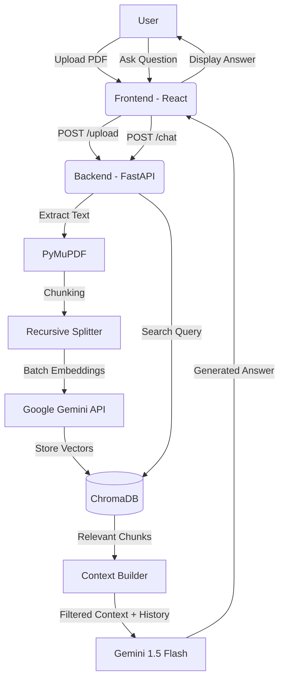

# 🧠 DocuMind AI

**AI-Powered Document Intelligence Platform** — Chat with your documents intelligently using RAG (Retrieval Augmented Generation) powered by Google Gemini AI.


## ✨ Features

- 📄 **PDF Upload** — Drag & drop PDF documents with **10x faster batch processing**.
- 🤖 **AI Chat** — Context-aware conversations powered by **Gemini 1.5 Flash**.
- 🔍 **Document Isolation** — Intelligent RAG pipeline that strictly filters context per document.
- 📚 **Chat History** — Persistent conversation history for every document session.
- 🎨 **Premium UI** — Modern dark mode with smooth animations and glassmorphism.
- 🚀 **New Chat** — Start fresh conversations anytime with a single click.

## 🏗️ Architecture & Workflow



## 🏗️ Tech Stack

| Layer | Technology |
|-------|-----------|
| Frontend | React + Vite + TailwindCSS |
| Backend | FastAPI (Python) |
| RAG Pipeline | LangChain + ChromaDB |
| AI Model | Google Gemini API |
| File Parsing | PyMuPDF |
| Embeddings | Google Generative AI Embeddings |

## 🚀 Quick Start

### 1. Get a Gemini API Key

Get your free API key from [Google AI Studio](https://aistudio.google.com)

### 2. Backend Setup

```bash
cd backend
pip install -r requirements.txt
```

Create a `.env` file in the `backend/` directory:

```
GEMINI_API_KEY=your_actual_api_key_here
```

Start the backend:

```bash
uvicorn main:app --reload
```

Backend runs at `http://localhost:8000`

### 3. Frontend Setup

```bash
cd frontend
npm install
npm run dev
```

Frontend runs at `http://localhost:5173`

## 📁 Project Structure

```
documind-ai/
├── frontend/              # React + Vite app
│   ├── src/
│   │   ├── components/    # UI components
│   │   ├── pages/         # Page components
│   │   ├── lib/           # Utilities & API client
│   │   └── App.jsx
│   └── package.json
├── backend/               # FastAPI app
│   ├── main.py            # App entry point
│   ├── routes/
│   │   ├── upload.py      # Document upload & management
│   │   └── chat.py        # Chat with documents
│   ├── rag/
│   │   ├── embeddings.py  # Google AI Embeddings
│   │   ├── vectorstore.py # ChromaDB operations
│   │   └── chain.py       # RAG chain with Gemini
│   ├── requirements.txt
│   └── .env
└── README.md
```

## 🔌 API Endpoints

| Method | Endpoint | Description |
|--------|----------|-------------|
| POST | `/upload` | Upload a PDF document |
| POST | `/chat` | Send a question, get AI answer |
| GET | `/chat/history/{id}` | Fetch persistent chat history |
| DELETE | `/chat/clear/{id}` | Clear history for a session |
| GET | `/documents` | List all uploaded documents |
| DELETE | `/document/{id}` | Delete a document |
| GET | `/health` | Health check |

## 📝 License

MIT License — feel free to use and modify.

## 🙏 Acknowledgments

- [Google Gemini AI](https://ai.google.dev/)
- [LangChain](https://langchain.com/)
- [ChromaDB](https://www.trychroma.com/)
- [FastAPI](https://fastapi.tiangolo.com/)
- [React](https://react.dev/)
